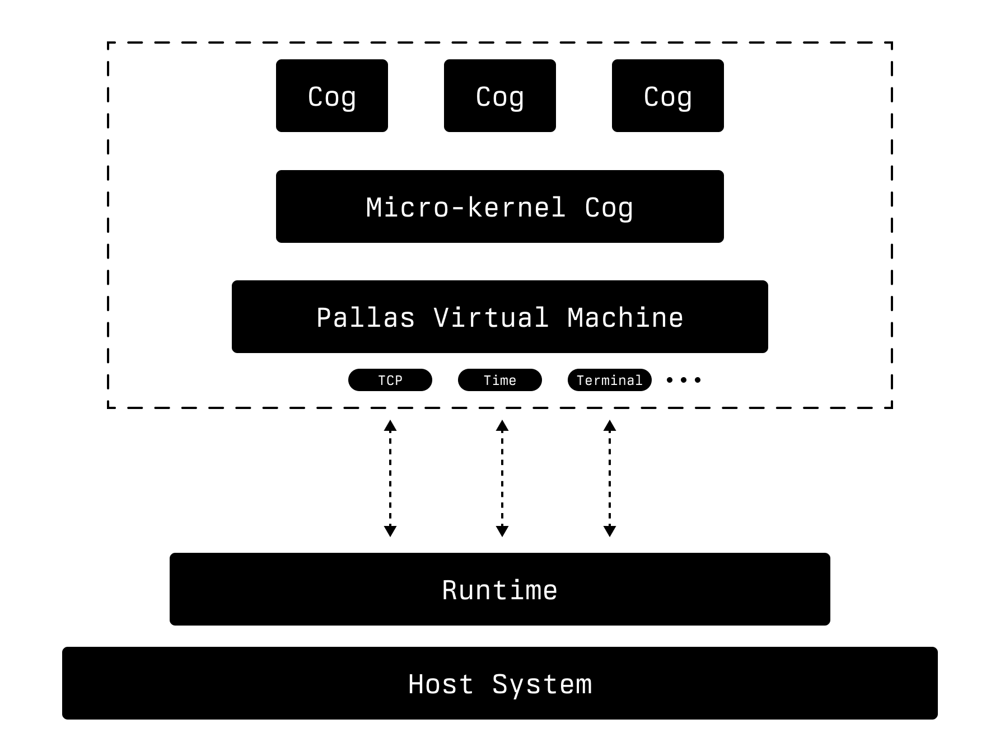

# Architecture

This section provides an overview of Pallas's architecture and introduces core system concepts, including:

* **Machines:** our virtual machine model
* **Cogs:** a virtualized process / database&#x20;
* **PLAN:** an ultra minimal, purely functional combinator interpreter (equivalent to "bytecode")
* **Sire:** the default system language

<figure><figcaption></figcaption></figure>

## Machines

A Pallas VM is colloquially referred to as a "machine". On the host filesystem, a machine consists of a directory containing a `data.mdb`, `lock.mdb` and a `pins` directory:

```
$ tree my-machines/machine1
machine1
├── data.mdb
├── lock.mdb
└── pins
    ├── 24
    │   └── 24ZTpfkWiejf34UAL21RNUWtTwz2sckvBQqYj4Yn1d4f
    ├── 2B
    │   └── 2BHstS7roP2kPE34XRUweJM9ZtBRcpG3wEdxP5ALhxSN
    <etc>
```

## Cogs

A "cog" is a persistent process running on a machine. Cogs interact with the world by making system calls - which are included as part of their state (thus a cog's set of system calls also resume after a restart). [Much more on cogs](../deeper/cogs.md).

## PLAN

1. [Persistence; Event Log; Database Engine](overview.md#persistence-event-log-database-engine)
2. [Closures and Supercombinators](overview.md#closures-and-supercombinators)
3. [PLAN](overview.md#plan-1)

Nearly every core innovation of Pallas emerges from the design of PLAN. It's not necessary to understand PLAN to write applications, but if you understand PLAN, you'll understand the system. &#x20;

PLAN is an evaluation model (you could think of this as the "machine code" of a Pallas VM) that implements a self-contained, purely-functional database with no external dependencies. A deeper discussion of the PLAN data structure will bring these two concepts together, but before we inspect PLAN itself we have to take a brief detour into how the Pallas VM achieves persistence.

### Persistence; Event Log; Database Engine

Let's say you wanted a write a small program that manages a list of numbers, starting with an empty list.

```
// Initial state
[]

// "append" adds a number to the end of the list
// append 1
[1]

// append 2
[1, 2]

// append 3
[1, 2, 3]
```

In these steps, we started with an empty list, but if we had started with `[1, 2]` and done `append 3` the result would have been `[1, 2, 3]`. Likewise, if we had started with `[1]` and done `append 2` the result would have been `[1, 2]`, etc.

The pattern to notice here is: given a current state and an input, we can reliably compute a next state.\
Taking that step further: if you have a starting state, the proper transition function that modifies the state for a given input, and a log of **all** **inputs**, you have a strategy for recovering the current state.

#### Persistence and Event Sourcing

Let's start by explaining the core concept of event sourcing using a simple representation:

```
T : (input, state) -> (outputs, newState)
```

In this model, our transition function `T` takes an input and the current state, and produces outputs along with a new state. This representation is intuitive for understanding basic event sourcing:

1. We have a current state
2. We receive an input
3. We apply the transition function T, which gives us:
   * Outputs
   * A new state

By logging all inputs and starting from an initial state, we can always reconstruct the current state by replaying these inputs through our transition function.

#### A Self-Upgrading System

Pallas supports self-upgrading code, where the system can modify its own behavior over time. To represent this capability, we need a slightly different model:

```
T : (state, input) -> (newState, T')
```

In this representation:

1. We still have a state and an input.
2. We produce a new state, but instead of static outputs, we now produce a new transition function `T'`.

This new `T'` can have modified behavior compared to the original `T`. It represents the system's ability to upgrade itself based on inputs and current state.

#### Why This Representation?

Keep in mind that this is not a formal definition of Pallas, but a representation to help illustrate some concepts. This representation was chosen because:

1. It shows state management, which is necessary for understanding persistence.
2. It shows upgradeable code.
3. It strikes a balance between simplicity and accuracy, making it accessible to newcomers while still representing key advanced features.

#### Persistence "for free"

You may have gotten the wrong idea: that the programmer has to `include` some kind of event log library or manually cache the current state. No, the persistence strategy outlined above is handled by the runtime automatically for all applications in Pallas. It only needs to be implemented once and it's trivially available to all applications. Because of this, it also means that optimizations happen in the runtime and are also available to all applications.

One such optimization is snapshotting the current state to avoid recomputing from the event log on restarts.

_But how can you take a "current state snapshot" if there are partially-applied functions like `T`? How do you store a partially applied function?_

With that question on the table, we're finally ready to explain PLAN by way of [closures](https://en.wikipedia.org/wiki/Closure\_\(computer\_programming\)).

### Closures and Supercombinators

[The Lambda Calculus](https://en.wikipedia.org/wiki/Lambda\_calculus) provides a formalism which would we could use to serialize and then persist a function. But there is a problem with using the lambda calculus directly: If you don't use an environment that tracks free variables, it is inefficient; but if you do use an environment, you've introduced implicit state.

We want to be able to easily write to and read from disk without any risk that there are free variables or assumed environment. In order to deal with that apparent contradiction, we must store _closures_. We want to store functions _together with their environment_.

The name for a function with zero free variables and no environment is a [_supercombinator_](https://wiki.haskell.org/Super\_combinator).\
PLAN is a data structure for supercombinators. Every function will always have all the context it could possibly need because they're all closures.

With PLAN at the bottom of the system, the same data structure is used on-disk and in-memory during execution. As a data structure, PLAN strikes a balance between:

* Human readability
* Candidacy for functional compile target
* Good memory representation
* Good on-disk representation

Other systems present alternative approaches for optimizing _one_ (or maybe two) of the above, but we believe PLAN is the best solution for accomplishing _all of the above_ well. Other systems solve each of these in isolation, which necessitates complicated transitions between specialized formats. That is obviated with PLAN, allowing the user more direct control over the system and "proximity to the metal" without loss of expressivity or performance.

### PLAN

PLAN is concrete, concise, and relatively readable, considering it's essentially a compiler binary (try reading the compiler binary of other systems).

It's also fast to compile to and easy to map back and forth between memory and disk - which is how you get a [single-level store](https://en.wikipedia.org/wiki/Single-level\_store) that essentially makes no distinction between in-memory and on-disk. Unplug it while it's running, move it to another physical machine, turn it back on and it picks up right where it left off.

Formally, it looks like this:

```
PLAN ::= <PLAN>           # Pin
       | {Nat Nat PLAN}   # Law
       | (PLAN PLAN)      # App
       | Nat              # Nat
```

Where a `Nat` is a natural number and a `Law` is a user-defined function. `() / App` denotes function application, `{} / Law` is a list of values and `<> / Pin` is a sort of runtime hint that has to do with optimizing memory layout.

We'll talk about what this means in a while, but for now let's just make clear that this is the **entire** data model of our system _and_ anything that users write using this system.

## Bootstrapping

You've seen the terms "compile" and "binary" thrown around a few times. We've also shown you this strange-looking PLAN data structure and made the case that if you just use this enhanced-lambda-calculus data structure you can have persistence, memory/disk ambiguity and readable compiler binaries for free. So at this point you might be asking yourself:\
"Do you expect me to write entire programs using that weird data structure?"

No. You've (hopefully) gotten used to thinking about this system as a database engine, but now we're going to show you that it's also a **virtual machine** and a **language platform**.

### Sire

Sire is a sort of Haskelly-Lisp whose purpose is to provide an ergonomic experience sitting between a programmer's goals and the resulting PLAN that achieves these goals (We'll get into [programming with Sire itself](sire/intro.md) a little later). Sire compiles _itself_ to the PLAN data model we saw above.

Below is the entire PLAN specification. Remember, PLAN is basically just the lambda calculus but without any need for an implicit environment. Don't get scared off or try to understand it just yet (or even _ever_, if you so choose), we're just showing off that it can fit on one page:

```
Every PLAN value is either a pin x:<i>, a law x:{n a b}, an app x:(f g), a
nat x:@, or a black hole x:<>.  Black holes only exist during evaluation.

(o <- x) mutates o in place, replacing it's value with x.

Run F(x) to normalize a value.

E(o:@)     = o                          | F(o) =
E(o:<x>)   = o                          |     E(o)
E(o:(f x)) =                            |     when o:(f x)
    E(f)                                |          F(f); F(x)
    when A(f)=1                         |     o
        o <- X(o,o)                     |
        E(o)                            | N(o) = E(o); if o:@ then o else 0
    o                                   |
E(o:{n a b}) =                          | I(f, (e x), 0) = x
    if a!=0 then o else                 | I(f, e,     0) = e
        o <- <>                         | I(f, (e x), n) = I(f, e, n-1)
        o <- R(0,o,b)                   | I(f, e,     n) = f
        E(o)                            |
                                        | A((f x))     = A(f)-1
X((f x), e)         = X(f,e)            | A(<p>)       = A(p)
X(<p>, e)           = X(p,e)            | A({n a b})   = a
X({n a b}, e)       = R(a,e,b)          | A(n:@)       = I(1, (3 5 3), n)
X(0, (_ n a b))     = {N(n) N(a) F(b)}  |
X(1, (_ p l a n x)) = P(p,l,a,n,E(x))   | R(n,e,b:@) | b≤n = I(x,e,(n-b))
X(2, (_ z p x))     = C(z,p,N(x))       | R(n,e,(0 f x))   = (R(n,e,f) R(n,e,x))
X(3, (_ x))         = N(x)+1            | R(n,e,(1 v b))   = L(n,e,v,b)
X(4, (_ x))         = <F(x)>            | R(n,e,(2 x))     = x
                                        | R(n,e,x)         = x
C(z,p,n) = if n=0 then z else (p (n-1)) |
                                        | L(n,e,v,b) =
P(p,l,a,n,(f x))   = (a f x)            |     x := <>
P(p,l,a,n,<x>)     = (p x)              |     f := (e x)
P(p,l,a,n,{n a b}) = (l n a b)          |     x <- R(n+1,f,v)
P(p,l,a,n,x:@}     = (n x)              |     R(n+1,f,b)
```

A plucky computer science student could translate this to C, Rust, Python - whatever language they prefer. A minimal but performant Haskell implementation is 180 lines.

The Sire compiler is just 2000 lines of Sire. Pallas has a compiled version _of the Sire compiler_ (that's `Sire-in-PLAN`) that we feed to the runtime system, thereby bootstrapping a complete, extensible development environment.

We aren't asking you to _trust_ our `Sire-in-PLAN` file. Since PLAN code is readable, a programmer familiar with the system can verify it directly.

This is the PLAN code for the `foldr` function. It's going to look only slightly less scary than the spec above, but read on so we can un-scare you:

```PLAN
* (_If a b c)=(2 c ((d e & d) b) a)
* (_Not a)=(_If a 0 1)
* (_IsApp a)=(1:(b&0):(b c d & 0):(b c & 1):(b&0) a)
* (_Null a)=(_Not _IsApp-a)
* (_Seq a b)=(2 b ((c d & c) b) a)
* (_Force a)=(0!0!1 2-a 0)
* (deepseq a b)=(_Seq _Force-a b)
* (_Cdr a)=(1:(b&b):(b c d & d):(b c & c):(b&0) a)
* (_Car a)=(1:(b&4):(b c d & 0-b-c):(b c & b):(b&0) a)
* (_Get a b)=(_If _Null-a 0 (2 _Cdr-a (_Get _Car-a) b))
* (_Idx a b)=(_Get b a)
* (id a)=a
* (_Dec a)=(2:0:id a)
*   = (_Len a)
    ^ a
    : (go b c ? _Seq b (_If _Null-c b (go 3-b _Car-c)))
    : 0
*   = (foldr a b c)
    ^ a c b 0 _Len-c
    ? (go d e f g h)
    (_If h (d _Get-e-g (go d e f 3-g _Dec-h)) f)
```

These are all the dependencies that the `foldr` function relies on.

Take a look at the `(id a)=a` line. It's a function named `id` that takes a single value `a` and simply returns it.\
Now look at `_Not` above. It appears to be a function that takes an argument `a`, and `_If` `a` is true, it returns `0` (or false), otherwise it returns `1` (or true). Not so bad.

Other bits are a little less clear to us right now, but the point remains: A programmer familiar with this system could verify the "compiler binaries" without trusting anyone. There is nowhere for malicious code to hide.

***

Next, we'll learn a bit about the runtime:
