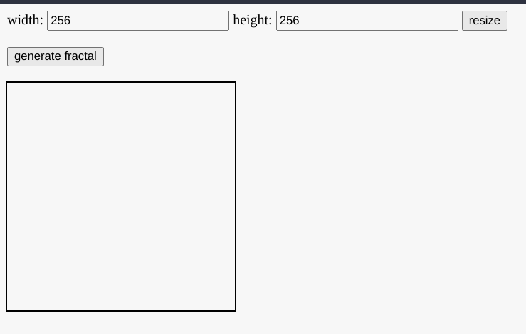

# Environment Setup

## Docker

If your system has Docker available you can simply pull use our Pallas image: https://github.com/deathtothecorporation/pallas-docker. That repo has [instructions](https://github.com/deathtothecorporation/pallas-docker) for quickly getting straight into a Sire REPL.

Once you're in the REPL, you should see something this:

```
<...>
("20_prp","LOADED FROM CACHE!")
("21_par","LOADED FROM CACHE!")
("boot","LOADED FROM CACHE!")

}
} ==== Sire REPL ====
}
} Since input is multi-line, there is currently no input-prompt.
} Just type away!
}

```

Try entering `(add 1 2)` and hitting enter.

Let's [learn some more Sire now](sire/intro.md)

## From source

If you don't have Docker available, you can install from souce. First off, you'll need the Plunder source code. The Vaporware project maintains a fork of Plunder (called Pallas. You can read more about the distinction [here](/deeper/pallas.md)). Clone it from [https://github.com/deathtothecorporation/pallas](https://github.com/deathtothecorporation/pallas). The rest of this guide will assume you're at the root of that repo.

### Dependency installation and first-run

> If your system does not or cannot run `nix`, you would need to install the Haskell and its build tool, `stack`, as well as `lmdb` and `zlib`. Once these requirements are satisfied, you can `stack install` at the root of the Pallas repo.
> **Once again, we highly recommend docker or nix for now**. Once the runtime matures, running Pallas will be as easy as running a single binary.


TODO: is the above true? "running Pallas will be as easy as running a single binary."


Because the current runtime is somewhat experimental, enormous time has not been invested into portability just yet. As a result, using `nix` is the most straightforward way to get Pallas running. (installing and configuring `nix` is outside the scope of this guide. We recommend using Docker if you're unable to use `nix`)

Any time you open a new terminal, you must remember to enter the development shell with nix by running:

```bash
nix develop
```

You will forget to do this and wonder why nothing is working. That's probably why.

Once you're in a nix development shell, run the following command to build the plunder environment:

```bash
stack build
```

This might take a while! When it's done, you should be able to verify all went well by running the mandelbrot web app demo:

```bash
bash sh/mandelbrot-ui-demo
```

That command should output something like this:

```

<...A lot more stuff up here...>

tabSplitLT          MATCHED
    , e "tabSplitLT"          "UdzPypcfJLtyMjLy87ukmU7nRHtfEv3nnZbfJ34isWM"
tabSing             MATCHED
    , e "tabSing"             "7AfouhmiExP9KSySjrw4k4VZ5JY2TE4cW53xo1EhHsfz"
[{2024-01-12T16:22:20.897758578Z} {REPLAY TIME: 0 ns}]

HTTP_SPINNING
_http_port=56191


= _http_port_file
} /home/your-user/plunder/.demo/4172716296342791002.http.port


Setting interface files...
Interface files are set. Running on http://localhost:56191/index.html
```

There is now a webserver running and you can access the app at the URL mentioned in the final line of output. **NOTE: the `index.html` at the end is required!**

<figure><figcaption></figcaption></figure>

Change the width and height to 100 and click "resize" (for expediency). Then click "generate fractal". After a few seconds you'll see a fractal appear in the canvas. Congratulations, you just ran a plunder app.

Soon you'll learn how to write one of your own.

## The `plunder` command and REPLs

Enter this command in a shell (where you've remembered to first run `nix develop`):

```
plunder
```

As of the time of this writing, you'll see the usage hint for the `plunder` command:

```
new-network - a test for running plunder machines

Usage: plunder COMMAND

  Let's run plunder.

Available options:
  -h,--help                Show this help text

Available commands:
  term                     Connect to the terminal of a cog.
  open                     Open a terminal's GUI interface.
  sire                     Run a standalone Sire repl.
  save                     Load a sire file and save a seed.
  show                     Print a seed file.
  repl                     Interact with a seed file.
  start                    Resume an idle machine.
  loot                     Run a standalone sire repl.
  boot                     Boot a machine.
  du                       du -ab compatible output for pin state.

```

We'll get into booting machines and running cogs soon, but first let's just get a Sire repl to play with.\
While the `repl` command looks attractive, it's not going to do exactly what you expect. **TODO: explain how seed files work** [**seed files**](../sire/seeds.md)

Remember that there is a [boot sequence](../overview/boot.md) required before we have all the necessary tools at hand. Since we want our environment to be hydrated properly, we'll do that boot sequence in order to get a proper repl:

```
plunder sire sire/prelude.sire
```

You'll see something like this:

```
<...>
("20_prp","LOADED FROM CACHE!")
("21_par","LOADED FROM CACHE!")
("boot","LOADED FROM CACHE!")

}
} ==== Sire REPL ====
}
} Since input is multi-line, there is currently no input-prompt.
} Just type away!
}

```

Try entering `(add 1 2)` and hitting enter.

Let's [learn some more Sire now](sire/intro.md)
